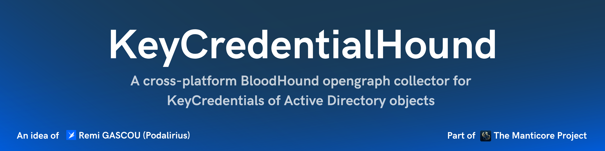
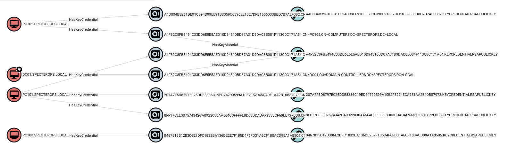
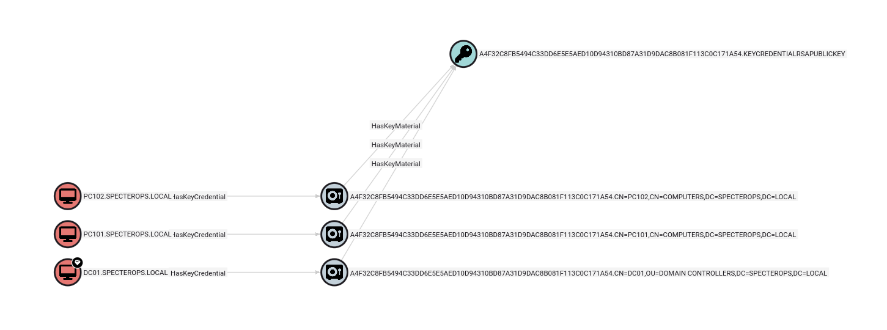
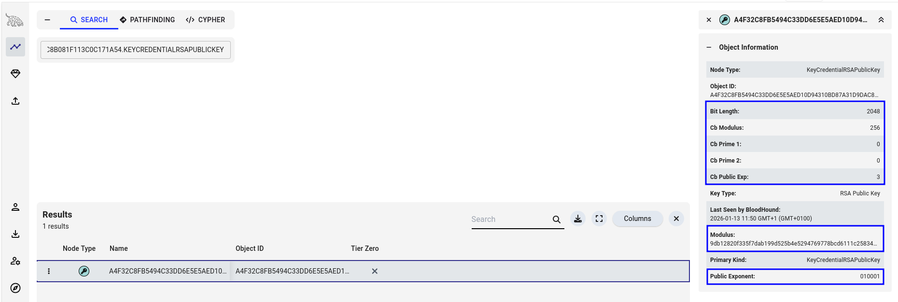

<p align="center">
  A cross-platform BloodHound opengraph collector for KeyCredentials of Active Directory objects using LDAP.
  <br>
  
  <a href="https://twitter.com/intent/follow?screen_name=podalirius_" title="Follow"></a>
  <a href="https://www.youtube.com/c/Podalirius_?sub_confirmation=1" title="Subscribe"></a>
  <br>
   <a href="https://specterops.io/bloodhound-enterprise/" title="Get BloodHound Enterprise"></a>
  <a href="https://specterops.io/bloodhound-community-edition/" title="Get BloodHound Community"></a>
  <br>
</p>


## Features

- [x] Read Key Credentials from LDAP
- [x] Export to BloodHound OpenGraph JSON format

## Cypher queries

### Find principals that share the same key material than another principal in their key credentials.

```cypher
MATCH x=(p1)-[:HasKeyCredential]->(:KeyCredential)
      -[:HasKeyMaterial]->(km)<-[:HasKeyMaterial]-
      (:KeyCredential)<-[:HasKeyCredential]-(p2)
WHERE p1 <> p2
RETURN x
```

## Examples from BloodHound

### All key credentials

```cypher
MATCH x=(p)-[:HasKeyCredential]->(:KeyCredential)-[:HasKeyMaterial]->(km)
RETURN x
```

The graph showing all key credentials of all Active Directory objects looks like this:



### Find principals that share the same key material than another principal in their key credentials.

```cypher
MATCH x=(p1)-[:HasKeyCredential]->(:KeyCredential)-[:HasKeyMaterial]->(km)<-[:HasKeyMaterial]-(:KeyCredential)<-[:HasKeyCredential]-(p2)
WHERE p1 <> p2
RETURN x
```

The graph showing principals that share the same key material looks like this:



### Key attributes

The key attributes can be seen in their properties like this:



## Usage

```
./KeyCredentialHound -h
Usage: KeyCredentialHound [--debug] [--output-file <string>] [--domain <string>] [--username <string>] [--password <string>] [--hashes <string>] --dc-ip <string> [--port <tcp port>] [--use-ldaps] [--use-kerberos]

  --debug                    Debug mode. (default: false)
  -o, --output-file <string> Output file name. (default: "")

  Authentication:
    -d, --domain <string>   Active Directory domain to authenticate to. (default: "")
    -u, --username <string> User to authenticate as. (default: "")
    -p, --password <string> Password to authenticate with. (default: "")
    -H, --hashes <string>   NT/LM hashes, format is LMhash:NThash. (default: "")

  LDAP Connection Settings:
    -dc, --dc-ip <string> IP Address of the domain controller or KDC (Key Distribution Center) for Kerberos. If omitted, it will use the domain part (FQDN) specified in the identity parameter.
    -P, --port <tcp port> Port number to connect to LDAP server. (default: 389)
    -l, --use-ldaps       Use LDAPS instead of LDAP. (default: false)
    -k, --use-kerberos    Use Kerberos instead of NTLM. (default: false)
```

## Contributing

Pull requests are welcome. Feel free to open an issue if you want to add other features.
